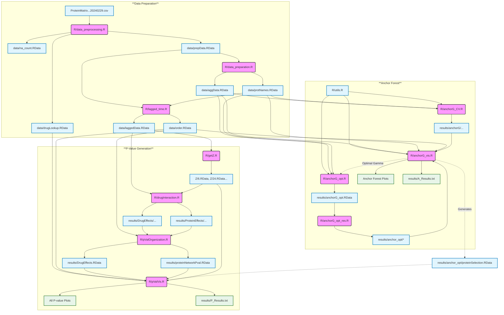

# Drug-Prot: A query system for statistical inference of drug effects and interactions in dynamic proteomic networks

This repository contains all the code used for the paper "[*Drug-Prot: A query system for statistical inference of drug effects and interactions in dynamic proteomic networks*]()" by Markus Ulmer, Rui Sun, Liujia Qian, Ruedi Aebersold, Tiannan Guo, and Peter Bühlmann (2026).

All the statistical analysis was run on the [*Euler*](https://scicomp.ethz.ch/wiki/Euler) using the batch jobs in the 
`slurm` folder. See [*here*](https://scicomp.ethz.ch/wiki/Euler_applications_and_libraries_ubuntu) and sessionInfo.txt for details about the used libraries. The experiment will need the following folders and the proteomics measurement `ProteinMatrix_sampleID_MapEC50_20240229.csv`.

```
📂 DrugProt
├── 📂 R
├── 📂 Z
├── 📂 data
│   └── 📊 ProteinMatrix_sampleID_MapEC50_20240229.csv
├── 📂 figures
└── 📂 results
    ├── 📂 DrugEffects
    ├── 📂 ProteinEffects
    ├── 📂 anchorG
    └── 📂 anchor_opt
```

### 1. Analysis Pipeline
Run the following scripts in order to reproduce the model fits:

1.  `prepare.slurm`: **Preprocessing** of the data.
2.  `getZ.sh`: Calculates projections needed for the **de-sparsified Lasso regressions**.
3.  `fit.slurm`: Fits the models.
4.  `anchorG_CV.sh`: Performs out-of-distribution cross-validation for the **Anchor Forests**.
5.  `anchorG_opt.slurm`: Refits the Anchor Forests with the optimal gamma.
    > *Note: Determine the optimal gamma from `R/anchorG_vis.R` (Line 71) before running.*
6.  `anchorG_opt_res.slurm`: Calculates regularization paths and partial dependencies.

### 2. Visualization & Output
Once the pipeline is complete, run these R scripts to generate figures:

1.  `anchorG_vis.R`: **Visualizes** the results from Anchor Forests and saves findings to `results/A_Results.txt`.
2.  `pValOrganization.R`: **Organizes** the p-values from `DrugProt` for visualization.
3.  `pValVis.R`: **Visualizes** the p-values from `DrugProt` and saves findings to `results/P_Results.txt`.

## More details on the different scripts

<details>
<summary><strong>📂 Click to view detailed File Inputs & Outputs</strong></summary>

### 1. Data Processing
| Script | Needs (Input) | Generates (Output) |
| :--- | :--- | :--- |
| `R/data_preprocessing.R` | `data/ProteinMatrix_sampleID_MapEC50_20240229.csv` | `data/drugLookup.RData`<br>`data/na_count.RData`<br>`data/prepData.RData` |
| `R/data_preparation.R` | `data/prepData.RData` | `data/aggData.RData`<br>`data/protNames.RData` |
| `R/lagged_time.R` | `data/prepData.RData`<br>`data/protNames.RData` | `data/order.RData`<br>`data/laggedData.RData` |

### 2. P-Value Generation
| Script | Needs (Input) | Generates (Output) |
| :--- | :--- | :--- |
| `R/getZ.R` | `data/laggedData.RData` | `Z/6.RData`<br>`Z/24.RData`<br>`Z/48.RData` |
| `R/drugInteraction.R` | `data/laggedData.RData`<br>`Z/6.RData`, `Z/24.RData`, `Z/48.RData` | `results/DrugEffects/...`<br>`results/ProteinEffects/...` |
| `R/pValOrganization.R` | `data/order.RData`<br>`results/DrugEffects/...`<br>`results/ProteinEffects/...` | `results/DrugEffects.RData`<br>`results/proteinNetworkPval.RData` |
| `R/pValVis.R` | `data/drugLookup.RData`<br>`data/order.RData`<br>`Z/6.RData`, `Z/24.RData`, `Z/48.RData`<br>`results/proteinNetworkPval.RData`<br>`results/anchor_opt/proteinSelection.RData` | **All P-value Plots**<br>`results/P_Results.txt` |

### 3. Anchor Forest Analysis
| Script | Needs (Input) | Generates (Output) |
| :--- | :--- | :--- |
| `R/anchorG_CV.R` | `R/utils.R`<br>`data/aggData.RData`<br>`data/protNames.RData` | `results/anchorG/...` |
| `R/anchorG_opt.R` | `R/utils.R`<br>`data/aggData.RData`<br>`data/protNames.RData` | `results/anchorG_opt.RData` |
| `R/anchorG_opt_res.R` | `results/anchorG_opt.RData` | `results/anchor_opt/var_importance.RData`<br>`results/anchor_opt/regPath.RData`<br>`results/anchor_opt/stability_selection.RData`<br>`results/anchor_opt/partial_dependence.RData` |
| `R/anchorG_vis.R` | `R/utils.R`<br>`data/aggData.RData`<br>`data/protNames.RData`<br>`data/order.RData`<br>`results/anchorG/...`<br>`results/anchor_opt/var_importance.RData`<br>`results/anchor_opt/regPath.RData`<br>`results/anchor_opt/stability_selection.RData`<br>`results/anchor_opt/partial_dependence.RData` | **Anchor Forest Plots**<br>`results/A_Results.txt`<br>`results/anchor_opt/proteinSelection.RData`<br>`results/most_important_proteins.txt` |

</details>



