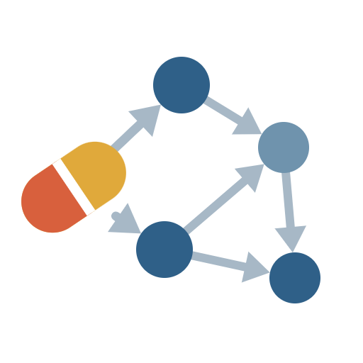
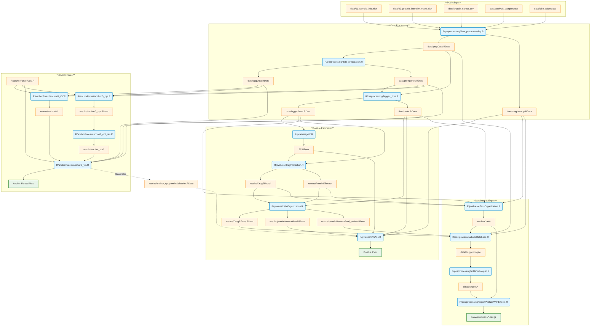

# Drug-Prot: A query system for statistical inference of drug effects and interactions in dynamic proteomic networks <a href="https://ulme.shinyapps.io/DrugProt/"></a>

This repository contains all the code used for the paper "[*Drug-Prot: A query system for statistical inference of drug effects and interactions in dynamic proteomic networks*]()" by Markus Ulmer, Rui Sun, Liujia Qian, Ruedi Aebersold, Tiannan Guo, and Peter Bühlmann (2026).

All the statistical analysis was run on [*Euler*](https://scicomp.ethz.ch/wiki/Euler) using the batch jobs in the `slurm` folder. See [*here*](https://scicomp.ethz.ch/wiki/Euler_applications_and_libraries_ubuntu) and sessionInfo.txt for details about the libraries used.

## Input data

The analysis runs from publicly available data. Two sources are needed.

**Perturbation proteomics**, from [db.prottalks.com](https://db.prottalks.com), published with [*Sun, R., Qian, L., Li, Y., et al. (2026). An operational perturbation proteomics-based virtual cell model. Nature.*](https://doi.org/10.1038/s41586-026-11001-9)

```
01_sample_info.xlsx
02_protein_intensity_matrix.xlsx
```

**Analysis inputs**, from the [Drug-Prot data deposit](https://doi.org/10.5281/zenodo.21508013), recording the sample selection, the protein identifiers and the viability values used here

```
analysis_samples.csv
protein_names.csv
ic50_values.csv
```

Place all five files in `data/`. The expected layout is

```
📂 DrugProt-Paper
├── 📂 R
│   ├── 📂 preprocessing
│   ├── 📂 pvalues
│   ├── 📂 anchorForest
│   └── 📂 postprocessing
├── 📂 Z
├── 📂 data
│   ├── 📊 01_sample_info.xlsx
│   ├── 📊 02_protein_intensity_matrix.xlsx
│   ├── 📊 analysis_samples.csv
│   ├── 📊 protein_names.csv
│   └── 📊 ic50_values.csv
├── 📂 figures
├── 📂 outfiles
├── 📂 slurm
└── 📂 results
    ├── 📂 Coef
    │   ├── 📂 drugs
    │   └── 📂 proteins
    ├── 📂 DrugEffects
    ├── 📂 ProteinEffects
    ├── 📂 anchorG
    └── 📂 anchor_opt
```

Create the empty directories before submitting any job, since the scripts write into them without creating them.

```bash
mkdir -p Z figures outfiles results/{DrugEffects,ProteinEffects,anchorG,anchor_opt} results/Coef/{drugs,proteins}
```

### 1. Analysis Pipeline
Run the following scripts in order to reproduce the model fits:

1.  `prepare.slurm`: **Preprocessing** of the data.
2.  `getZ.sh`: Calculates projections needed for the **de-sparsified Lasso regressions**.
3.  `fit.slurm`: Fits the models.
4.  `anchorG_CV.sh`: Performs out-of-distribution cross-validation for the **Anchor Forests**.
5.  `anchorG_opt.slurm`: Refits the Anchor Forests with the optimal gamma.
    > *Note: Determine the optimal gamma from `R/anchorForest/anchorG_vis.R` (Line 71) before running.*
6.  `anchorG_opt_res.slurm`: Calculates regularization paths and partial dependencies.

`pValAnalysis.slurm` runs the simulation study validating the calibration of the high-dimensional p-values. It depends only on the preprocessing and on `getZ.sh`, so it can run alongside the rest.

### 2. Visualization & Output
Once the pipeline is complete, run these R scripts to generate figures:

1.  `anchorG_vis.R`: **Visualizes** the results from Anchor Forests and saves findings to `results/A_Results.txt`.
2.  `pValOrganization.R`: **Organizes** the p-values from `DrugProt` for visualization.
3.  `pValVis.R`: **Visualizes** the p-values from `DrugProt` and saves findings to `results/P_Results.txt`.

### 3. Database & Export
These scripts turn the model output in `results/` into the artifacts published in the [Drug-Prot data deposit](https://doi.org/10.5281/zenodo.21508013): the Parquet store that backs the [Shiny application](https://github.com/markusul/DrugProt), and the human-readable CSV export. Run them after the analysis pipeline has completed.

1.  `effecsOrganization.R`: Collects the estimated coefficients per drug and per protein into `results/Coef/`.
2.  `buildDatabase.R`: Collects all p-values and coefficients into a single indexed SQLite database.
3.  `sqliteToParquet.R`: Converts that database into one compressed Parquet file per table.
4.  `exportPvaluesWithEffects.R`: Writes the human-readable CSV export, with effect magnitudes attached per row.

> *Note: `sqliteToParquet.R` exports every table it finds, including SQLite's internal `sqlite_stat1` and `sqlite_stat4` tables created by the closing `ANALYZE`. Remove these before publishing the Parquet directory.*

> *Note: `buildDatabase.R` stores only the **sign** of the protein-network coefficients, which is all the application needs to colour edges. `exportPvaluesWithEffects.R` therefore reads the magnitudes directly from `results/Coef/`, and must run where `results/` is still available.*

To deploy the application locally, copy `data/parquet/` into the root of the [DrugProt](https://github.com/markusul/DrugProt) repository as `parquet/`.

## More details on the different scripts

<details>
<summary><strong>📂 Click to view detailed File Inputs & Outputs</strong></summary>

### 1. Data Processing

| Script | Needs (Input) | Generates (Output) |
| :--- | :--- | :--- |
| `R/preprocessing/data_preprocessing.R` | `data/01_sample_info.xlsx`<br>`data/02_protein_intensity_matrix.xlsx`<br>`data/protein_names.csv`<br>`data/analysis_samples.csv`<br>`data/ic50_values.csv` | `data/drugLookup.RData`<br>`data/na_count.RData`<br>`data/prepData.RData` |
| `R/preprocessing/data_preparation.R` | `data/prepData.RData` | `data/aggData.RData`<br>`data/protNames.RData` |
| `R/preprocessing/lagged_time.R` | `data/prepData.RData`<br>`data/protNames.RData` | `data/order.RData`<br>`data/laggedData.RData` |

### 2. P-value Estimation

| Script | Needs (Input) | Generates (Output) |
| :--- | :--- | :--- |
| `R/pvalues/getZ.R` | `data/laggedData.RData` | `Z/6.RData`<br>`Z/24.RData`<br>`Z/48.RData` |
| `R/pvalues/drugInteraction.R` | `data/laggedData.RData`<br>`Z/6.RData`, `Z/24.RData`, `Z/48.RData` | `results/DrugEffects/...`<br>`results/ProteinEffects/...` |
| `R/pvalues/pValOrganization.R` | `data/order.RData`<br>`results/DrugEffects/...`<br>`results/ProteinEffects/...` | `results/DrugEffects.RData`<br>`results/proteinNetworkPval.RData`<br>`results/proteinNetworkPval_pvalue.RData` |
| `R/pvalues/validationOfPvalues.R` | `data/laggedData.RData`<br>`Z/6.RData`, `Z/24.RData`, `Z/48.RData` | `results/PvalAnalysis.RData` |
| `R/pvalues/pValVis.R` | `data/drugLookup.RData`<br>`data/order.RData`<br>`Z/6.RData`, `Z/24.RData`, `Z/48.RData`<br>`results/proteinNetworkPval.RData`<br>`results/anchor_opt/proteinSelection.RData` | **All P-value Plots**<br>`results/P_Results.txt` |

### 3. Anchor Forest Analysis

| Script | Needs (Input) | Generates (Output) |
| :--- | :--- | :--- |
| `R/anchorForest/anchorG_CV.R` | `R/anchorForest/utils.R`<br>`data/aggData.RData`<br>`data/protNames.RData` | `results/anchorG/...` |
| `R/anchorForest/anchorG_opt.R` | `R/anchorForest/utils.R`<br>`data/aggData.RData`<br>`data/protNames.RData` | `results/anchorG_opt.RData` |
| `R/anchorForest/anchorG_opt_res.R` | `results/anchorG_opt.RData` | `results/anchor_opt/var_importance.RData`<br>`results/anchor_opt/regPath.RData`<br>`results/anchor_opt/stability_selection.RData`<br>`results/anchor_opt/partial_dependence.RData` |
| `R/anchorForest/anchorG_vis.R` | `R/anchorForest/utils.R`<br>`data/aggData.RData`<br>`data/protNames.RData`<br>`data/order.RData`<br>`results/anchorG/...`<br>`results/anchor_opt/var_importance.RData`<br>`results/anchor_opt/regPath.RData`<br>`results/anchor_opt/stability_selection.RData`<br>`results/anchor_opt/partial_dependence.RData` | **Anchor Forest Plots**<br>`results/A_Results.txt`<br>`results/anchor_opt/proteinSelection.RData`<br>`results/most_important_proteins.txt` |

### 4. Database & Export

| Script | Needs (Input) | Generates (Output) |
| :--- | :--- | :--- |
| `R/pvalues/effecsOrganization.R` | `data/order.RData`<br>`data/laggedData.RData`<br>`data/drugLookup.RData`<br>`results/DrugEffects/...`<br>`results/ProteinEffects/...` | `results/Coef/drugs/treatNames.RData`<br>`results/Coef/drugs/{drug}.RData`<br>`results/Coef/proteins/{protein}_{hours}.RData` |
| `R/postprocessing/buildDatabase.R` | `data/order.RData`<br>`data/drugLookup.RData`<br>`results/DrugEffects.RData`<br>`results/proteinNetworkPval_pvalue.RData`<br>`results/Coef/drugs/treatNames.RData`<br>`results/Coef/drugs/{drug}.RData`<br>`results/Coef/proteins/{protein}_{hours}.RData` | `data/drugprot.sqlite` |
| `R/postprocessing/sqliteToParquet.R` | `data/drugprot.sqlite` | `data/parquet/*.parquet` |
| `R/postprocessing/exportPvaluesWithEffects.R` | `data/parquet/`<br>`results/Coef/drugs/{drug}.RData`<br>`results/Coef/proteins/{protein}_{hours}.RData` | `data/downloads/drug_pvalues_effects.csv.gz`<br>`data/downloads/protein_network_effects.csv.gz` |

</details>

## Pipeline


```mermaid
graph TD
    classDef script fill:#e1f5ff,stroke:#0288d1,stroke-width:2px
    classDef file fill:#fff3e0,stroke:#f57c00,stroke-width:1px
    classDef output fill:#e8f5e9,stroke:#388e3c,stroke-width:2px

    subgraph Input ["**Public input**"]
        I1[data/01_sample_info.xlsx]:::file
        I2[data/02_protein_intensity_matrix.xlsx]:::file
        I3[data/protein_names.csv]:::file
        I4[data/analysis_samples.csv]:::file
        I5[data/ic50_values.csv]:::file
    end

    subgraph Prep ["**Data Processing**"]
        S1(R/preprocessing/data_preprocessing.R):::script
        S2(R/preprocessing/data_preparation.R):::script
        S3(R/preprocessing/lagged_time.R):::script

        I1 & I2 & I3 & I4 & I5 --> S1
        S1 --> D1[data/prepData.RData]:::file
        S1 --> D6[data/drugLookup.RData]:::file
        D1 --> S2
        S2 --> D2[data/aggData.RData]:::file
        S2 --> D3[data/protNames.RData]:::file
        D1 & D3 --> S3
        S3 --> D4[data/laggedData.RData]:::file
        S3 --> D5[data/order.RData]:::file
    end

    subgraph PVal ["**P-value Estimation**"]
        S4(R/pvalues/getZ.R):::script
        S5(R/pvalues/drugInteraction.R):::script
        S6(R/pvalues/pValOrganization.R):::script
        S7(R/pvalues/pValVis.R):::script

        D4 --> S4
        S4 --> Z[Z/*.RData]:::file
        D4 & Z --> S5
        S5 --> R1[results/DrugEffects/*]:::file
        S5 --> R2[results/ProteinEffects/*]:::file
        D5 & R1 & R2 --> S6
        S6 --> R3[results/DrugEffects.RData]:::file
        S6 --> R4[results/proteinNetworkPval.RData]:::file
        S6 --> R8[results/proteinNetworkPval_pvalue.RData]:::file
        D5 & D6 & Z & R4 --> S7
        S7 --> O1[P-value Plots]:::output
    end

    subgraph Anchor ["**Anchor Forest**"]
        S8(R/anchorForest/anchorG_CV.R):::script
        S9(R/anchorForest/anchorG_opt.R):::script
        S10(R/anchorForest/anchorG_opt_res.R):::script
        S11(R/anchorForest/anchorG_vis.R):::script

        Utils[R/anchorForest/utils.R]:::file

        D2 & D3 & Utils --> S8
        S8 --> R5[results/anchorG/*]:::file
        D2 & D3 & Utils --> S9
        S9 --> R6[results/anchorG_opt.RData]:::file
        R6 --> S10
        S10 --> R7[results/anchor_opt/*]:::file
        D2 & D3 & D5 & Utils & R5 & R7 --> S11
        S11 --> O2[Anchor Forest Plots]:::output
    end

    subgraph Database ["**Database & Export**"]
        S12(R/pvalues/effecsOrganization.R):::script
        S13(R/postprocessing/buildDatabase.R):::script
        S14(R/postprocessing/sqliteToParquet.R):::script
        S15(R/postprocessing/exportPvaluesWithEffects.R):::script

        D5 & D4 & D6 & R1 & R2 --> S12
        S12 --> Coef[results/Coef/*]:::file
        D1 & D6 & R3 & R8 & Coef --> S13
        S13 --> DB[data/drugprot.sqlite]:::file
        DB --> S14
        S14 --> PQ[data/parquet/*]:::file
        PQ & Coef --> S15
        S15 --> CSV[data/downloads/*.csv.gz]:::output
    end

    S11 -.->|Generates| Sel[results/anchor_opt/proteinSelection.RData]:::file
    Sel -.-> S7
```
